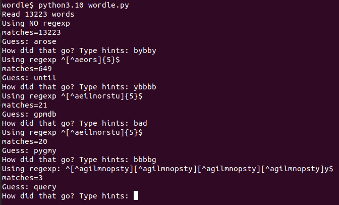

This is a quick and dirty program to solve [Wordle](https://www.powerlanguage.co.uk/wordle/).

It is something that I hacked up quickly. There are lots of problems with the code (e.g. no tests!) and other improvements possible. See the Todo section below.

# Usage

This requires python 3.10 (sorry! I wanted to use match/case statements). 

When you run the program. It comes up with a guess. You type that guess into wordle (this step has to be done manually by you). Then you type in the resultant hints into the program. The hints need to be typed in as a 5-letter string with "g" standing for green (i.e. letter is in the word and in the correct spot), "y" for yellow (i.e. letter is in the word but in the wrong spot), and "b" for black (actually grey, but "g" taken; meaning the letter is not in the word in any spot).

In the session above, the 4th guess "query" was the correct answer.

# Algorithm

The algorithm is rather simplistic. The basic idea is this:

1. The variables `exact_matches`, `included_letters`, and `disallowed_letters` keep track of the hints provided by wordle so far
2. Using this, create a regexp to match candidate words
3. Filter the wordlist (linux_words.txt) using the regexp to produce a list of candidates
4. Use a scoring algorithm to give a score to each candidate
5. Output the candidate with the highest score.

The algorithm has 2 modes of operation: EXPLORE and GUESS. The first few guesses are made in EXPLORE mode, where the algorithm is simply trying to find out which letters are there in the word. Later, in GUESS mode, it is actually trying to guess the correct word. The simple algorithm described above works slightly differently depending on the mode.

In EXPLORE mode, in step #2, the regexp used to filter the candidate words uses only letters that have not been tried so far. Specifically, all the letters in `exact_matches`, `included_letters`, and `disallowed_letters` are removed and only words made up of the remaining letters are considered.

In EXPLORE mode, we are trying to pick words with the most promising letters (i.e. the most common letters). So, for scoring the words in step #4, we do this in two phases. We first give a `letter_score` to each of the 26 letters of the alphabet. The letter score is based on the frequencies of all the words that the letter appears in. Now, each word gets a score which is simply the sum of the `letter_scores` of the letters in that word. The word with the highest score is output as the guess.

In GUESS mode, in step #2, regexp used to filter the candidate words uses the `exact_matches` in their correct places, and in all the other positions, it uses all letters of the alphabet other than the `disallowed_letters`. After the candidate list is created, all words not containing the `disallowed_letters` are removed.

To score words in GUESS mode, we simply use the frequency of the word from wordfreq.txt. (The most common word from the candidate list is output)

# Todo

This code was written quickly in a couple of hours, and hence is not very well written:

- Write tests
- The algorithm used is rather simple; much more sophisticated algorithms are possible
- The data structures are rather simplistic 
- The code will probably not work well if a letter appears multiple times in the word. This needs to be fixed
- Re-write it to work with older versions of Python (because lots of people probably don't have access to 3.10 yet)

Most importantly, the code is not really structured to allow easy experimentation with different configurations and algorithms (via the use of appropriate design patterns)

Other extensions possible:

- Algorithm evaluator: for any algorithm, run it through *all* the words in Wordle's wordlist and see how many it solves and what is the average number of steps required

# Acknowledgements

The wordfreq.txt file is derived from the [count_1w.txt file](http://norvig.com/ngrams/count_1w.txt) from [Peter Norvig's "Natural Language Corpus Data: Beautiful Data" page](http://norvig.com/ngrams/) which is derived from  the Google Web Trillion Word Corpus, as [described](https://ai.googleblog.com/2006/08/all-our-n-gram-are-belong-to-you.html) by Thorsten Brants and Alex Franz, and [distributed](https://catalog.ldc.upenn.edu/LDC2006T13) by the Linguistic Data Consortium.

# Other Wordle Solvers

Check out these other Wordle solvers

- [https://github.com/coolbutuseless/wordle]
- [https://github.com/LaurentLessard/wordlesolver]
- [https://github.com/deedy/wordle-solver]

# License

Public domain. Do what you want with this code.

The code does contain the following word lists which are governed by other licenses:

- `linux_words.txt`: GPL
- `wordle_words.txt`: Taken from [Wordle's website](https://www.powerlanguage.co.uk/wordle/). Not sure what the license is.
- `count_1w.txt`: Not sure what the license is. Check [this website](https://ai.googleblog.com/2006/08/all-our-n-gram-are-belong-to-you.html) or [this](https://catalog.ldc.upenn.edu/LDC2006T13).
